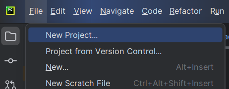
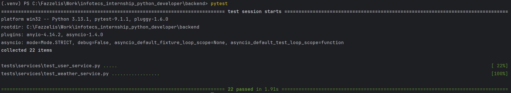

## Запуск проекта

### Шаг 1. Создайте в pycharm новый проект

### Шаг 2. Перенесите все файлы из архива в папку проекта
### Шаг 3. Установите зависимости проекта
```
pip install -r requirements.txt
```
### Шаг 4. Запустите приложение
```
python3 script.py
```
Если не сработал, то используйте:
```
python script.py
```


## Описание методов API

### 1. Получение текущей погоды по координатам

Возвращает актуальные данные о погоде в указанной географической точке на момент запроса.

**Endpoint:** `GET /weather/get-by-coordinates`

**Параметры запроса:**

| Параметр | Тип | Обязательный | Описание |
|----------|-----|--------------|----------|
| `latitude` | number | Да | Широта (от -90 до 90) |
| `longitude` | number | Да | Долгота (от -180 до 180) |

Пример ответа:
```json
{
  "temperature": "string",
  "wind_speed": "string",
  "pressure": "string"
}
```

### 2. Добавление города в список отслеживаемых

Добавляет город в список отслеживаемых. Сервер автоматически обновляет прогноз погоды для этого города каждые 15 минут. Прогноз хранится на текущий день.

**Endpoint:** `GET /weather/subscribe-to-city`

**Параметры запроса:**

| Параметр    | Тип    | Обязательный | Описание                   |
|-------------|--------|--------------|----------------------------|
| `user_id`   | string | Да | Идентификатор пользователя |
| `name`      | string | Да | Название города            |
| `latitude`  | number | Да | Широта (от -90 до 90)      |
| `longitude` | number | Да | Долгота (от -180 до 180)   |

Пример ответа:
```json
{
  "status": "string",
  "message": "string"
}
```

### 3. Получение списка городов

Возвращает список всех отслеживаемых городов, для которых сервер хранит и обновляет прогноз погоды.

**Endpoint:** `GET /weather/my-cities`

**Параметры запроса:**

| Параметр    | Тип    | Обязательный | Описание                   |
|-------------|--------|--------------|----------------------------|
| `user_id`   | string | Да | Идентификатор пользователя |

Пример ответа:
```json
{
  "len": 0,
  "cities": [
    {
      "name": "string"
    }
  ]
}
```

### 4. Получение прогноза погоды для города на определенное время

Возвращает прогноз погоды для указанного города на текущий день в заданное время. Позволяет выбрать, какие параметры погоды включить в ответ.

**Endpoint:** `GET /weather`

**Параметры запроса:**

| Параметр        | Тип    | Обязательный | Описание                         |
|-----------------|--------|--------------|----------------------------------|
| `user_id`       | string | Да | Идентификатор пользователя       |
| `city_name`     | string | Да | Название города                  |
| `forecast_time` | time   | Да | Время в формета HH:MM:SS         |
| `include_temperature` | bool   | Да | Флаг для отображения температуры |
| `include_humidity` | bool   | Да | Флаг для отображения влажности   |
| `include_wind_speed` | bool   | Да |Флаг для отображения скорости ветра   |
| `include_precipitation` | bool   | Да | Флаг для отображения осадков     |

Пример ответа:
```json
{
  "city_name": "string",
  "datetime": "string",
  "temperature": "string",
  "humidity": "string",
  "wind_speed": "string",
  "precipitation": "string"
}
```

### 5. Регистрация пользователя

Регистрирует нового пользователя в системе

**Endpoint:** `GET /user/registration`

**Параметры запроса:**

| Параметр    | Тип    | Обязательный | Описание                                                                               |
|-------------|--------|--------------|----------------------------------------------------------------------------------------|
| `login`     | string | Да | Логин пользователя (длина от 1 до 50 символов)                                         |
| `password`  | string | Да | Пароль пользователя (длина от 8, имеет хотя бы одну заглавную, строчную букву и цифру) |

Пример ответа:
```json
{
  "id": "string",
  "login": "string"
}
```

### 6. Вход в аккаунт пользователя

Выполняет вход в аккаунт пользователя

**Endpoint:** `GET /user/login`

**Параметры запроса:**

| Параметр    | Тип    | Обязательный | Описание                                                                               |
|-------------|--------|--------------|----------------------------------------------------------------------------------------|
| `login`     | string | Да | Логин пользователя                                        |
| `password`  | string | Да | Пароль пользователя |

Пример ответа:
```json
{
  "id": "string",
  "login": "string"
}
```

## Unit тесты
### Для запуска unit тестов выполните следующую команду в корне проекта:
```
pytest
```
Итог выполнения команды:
